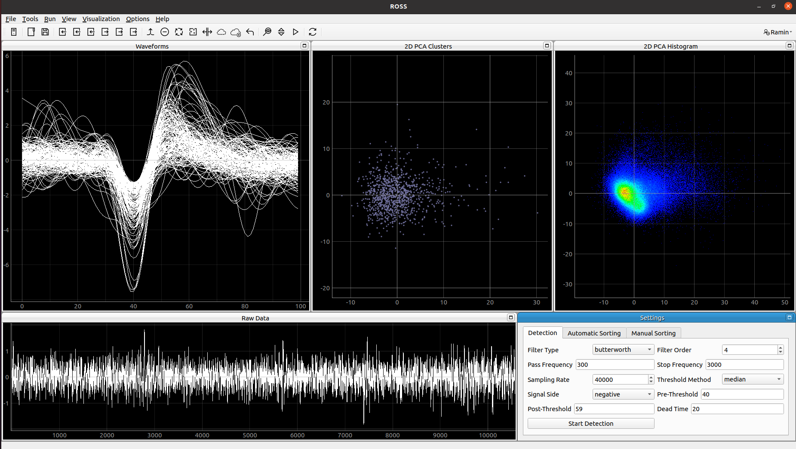
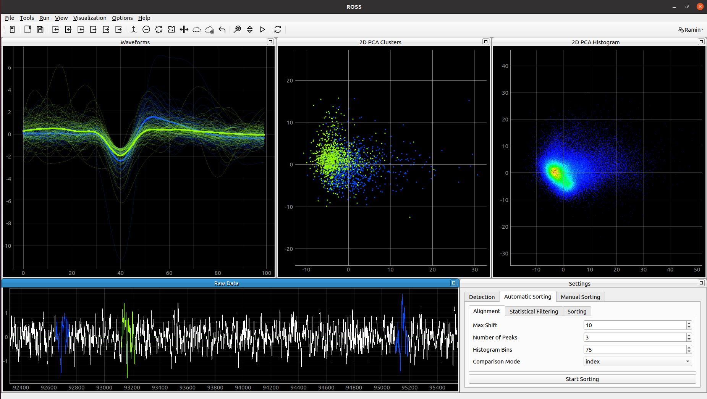
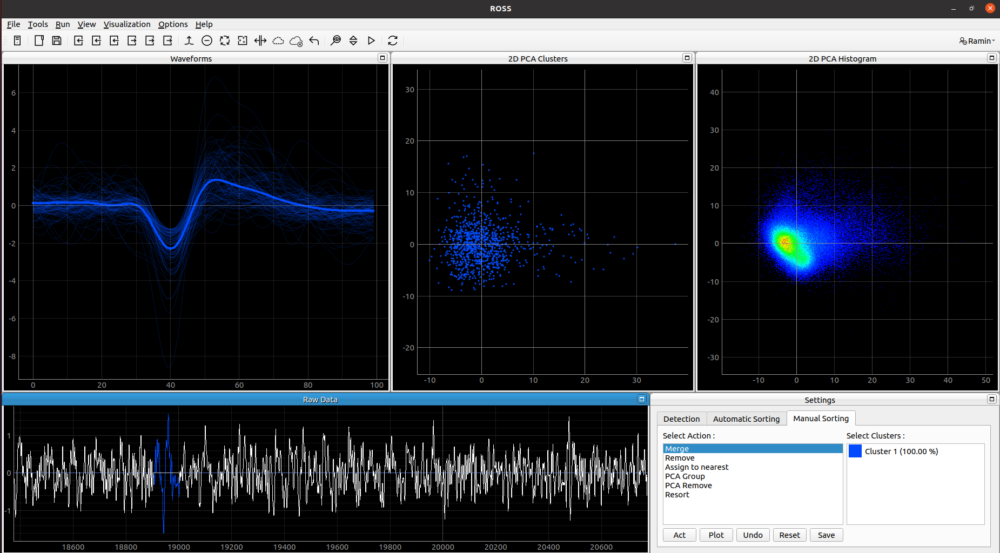
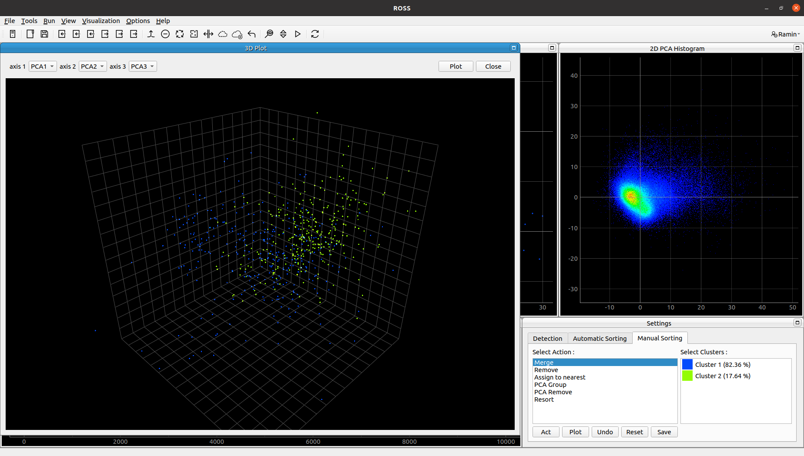
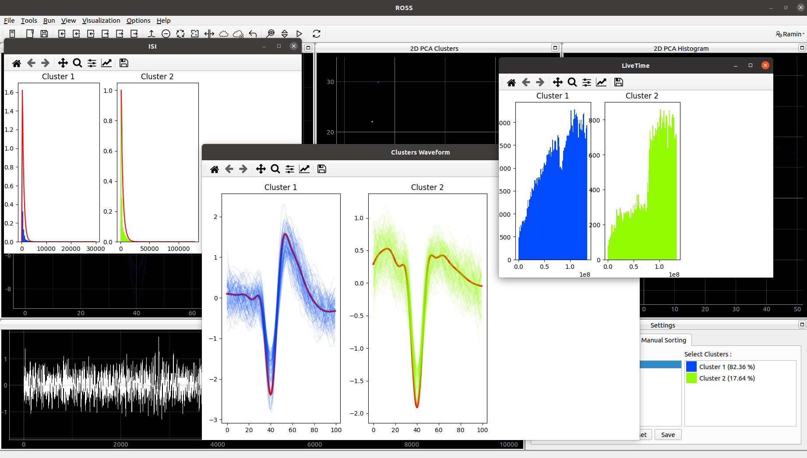

# ROSS v2


ROSS v2 (beta) is the Python version of offline spike sorting software implemented based on the methods described in the paper entitled [An automatic spike sorting algorithm based on adaptive spike detection and a mixture of skew-t distributions](https://www.nature.com/articles/s41598-021-93088-w). (Official Python Implementation)

### Important Note on ROSS v2
ROSS v2 is implemented based on the client-server architecture. In the beta version, the GUI and processing units are completely separated and their connection is based on Restful APIs. However, at this moment, it only works on one machine and we try to find a good way to optimize the data transfer between the client and the server. In our final release, you would be able to run the light GUI on a simple machine while the data and algorithms would be executed on a separate server in your lab. 

## Requirements
- All the requirement packages are listed at requirements.txt file in root path

## How to install
1- Git Clone this repository to your local path.

2- Install the requirements.txt by running : ```pip install -r requirements.txt```

## How to run

1- Run the backend by typing  ```python ./ross_backend/app.py``` in the terminal.

2- Run the UI by typing  ```python ./ross_ui/main.py``` in the terminal.

3- The first time you want to use the software, you must define a user as follows:

In opened window, click on ```Options``` ---> ```Sign In/Up``` , enter the desired username and password, click on ```Sign Up```.

4- The next time you want to use the software, just click on ```Options``` ---> ```Sign In/Up``` and enter your username and password, click on ```Sign In``` .

5- Import your "Raw Data" as follows : 

In opened window, click on ```File``` ---> ```Import``` ---> ```Raw Data``` , select the data file from your system, then, select the variable containing raw-data ```(LFP/Spike)``` and click on ```OK```.

6- Now you can Go on and enjoy the Software. 

For more instructions and samples please visit ROSS documentation at (link), or demo video at (link).
## Usage

ROSS v2, same as v1, provides useful tools for spike detection, automatic and manual sorting. 

- Detection

  You can load raw extracellular data and adjust the provided settings for filtering and thresholding. Then by pushing **Start Detection** button the detection results appear in a PCA plot:
  


- Automatic Sorting

  Automatic sorting is implemented based on five different methods: skew-t and t distributions, GMM, k-means and template matching. Several options are provided for configurations in the algorithm. Automatic sorting results will appear in PCA and waveform plots:
 

- Manual Sorting

  Manual sorting tool is used for manual modifications on automatic results by the researcher. These tools include: Merge, Delete, Resort and Manual grouping or deleting samples in PCA domain:
  


- Visualization
  
  - Several visualization tools are provided such as: 3D plot
  
  
   - Also, inter spike interval, neuron live time and Cluster Waveforms
  

  


